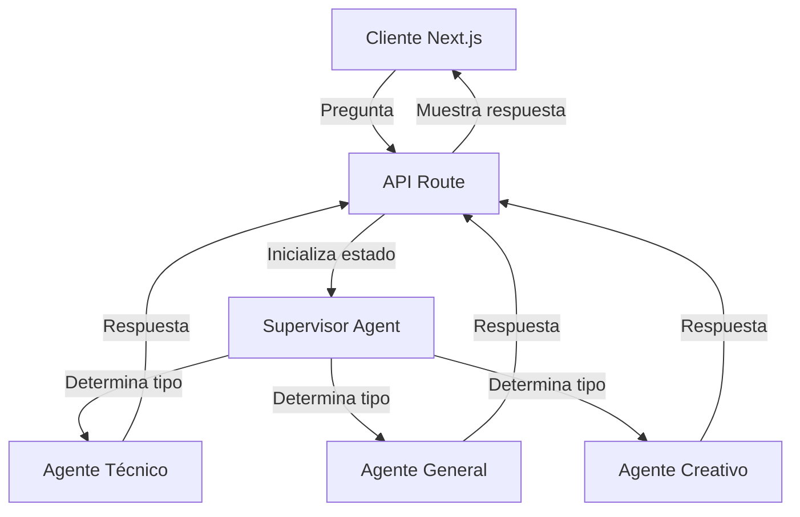

# Chat con Agentes Especializados

Una aplicación web que utiliza LangGraph y OpenAI para crear un sistema de chat con múltiples agentes especializados. Cada agente está diseñado para manejar diferentes tipos de preguntas: técnicas, generales y creativas.

## 🚀 Características

- Interfaz de chat intuitiva
- Tres agentes especializados:
  - Agente Técnico: Para preguntas técnicas y detalladas
  - Agente General: Para preguntas de conocimiento general
  - Agente Creativo: Para respuestas imaginativas e innovadoras
- Sistema de enrutamiento inteligente que determina el agente más adecuado
- Respuestas en español
- Envío de mensajes con Enter

## 🏗️ Arquitectura



## 📦 Prerequisitos

- Node.js 18.x o superior
- npm o yarn
- Una API key de OpenAI

## 🔧 Instalación

1. Clona el repositorio:
```bash
git clone [url-del-repositorio]
cd clase-bk
```

2. Instala las dependencias:
```bash
npm install
# o
yarn install
```

3. Crea un archivo `.env.local` en la raíz del proyecto con tu API key de OpenAI:
```env
OPENAI_API_KEY=tu-api-key-aquí
```

## 🚀 Ejecución

Para ejecutar el proyecto en modo desarrollo:

```bash
npm run dev
# o
yarn dev
```

La aplicación estará disponible en `http://localhost:3000`

## 🛠️ Estructura del Proyecto

```
src/
├── app/                    # Páginas y rutas de Next.js
│   ├── api/               # Endpoints de la API
│   └── page.tsx           # Página principal
├── components/            # Componentes React
│   └── ChatInterface.tsx  # Interfaz de chat
└── lib/
    └── agents/            # Lógica de los agentes
        ├── agents/        # Implementación de cada agente
        │   ├── technicalAgent.ts
        │   ├── generalAgent.ts
        │   └── creativeAgent.ts
        ├── types.ts       # Tipos compartidos
        └── agentConfig.ts # Configuración del workflow
```

## 🤖 Cómo Funciona

1. **Flujo de Usuario**:
   - El usuario ingresa una pregunta en la interfaz
   - La pregunta se envía al endpoint `/api/chat`
   - Se muestra la respuesta con el tipo de agente que la generó

2. **Flujo de Agentes**:
   - El Supervisor Agent analiza la pregunta
   - Determina qué agente especializado es más adecuado
   - El agente seleccionado genera una respuesta
   - La respuesta se devuelve al usuario

3. **Características de los Agentes**:
   - **Supervisor**: Analiza y clasifica las preguntas
   - **Técnico**: Responde preguntas técnicas con detalle
   - **General**: Proporciona información balanceada y general
   - **Creativo**: Genera respuestas innovadoras e imaginativas

## 🛠️ Tecnologías Utilizadas

- Next.js 14
- React
- TypeScript
- LangGraph
- OpenAI API
- Tailwind CSS

## 📝 Licencia

Este proyecto está bajo la Licencia MIT. Ver el archivo `LICENSE` para más detalles.

## 🤝 Contribuciones

Las contribuciones son bienvenidas. Por favor, abre un issue o envía un pull request.

## 📧 Contacto

Para cualquier pregunta o sugerencia, por favor abre un issue en el repositorio. 