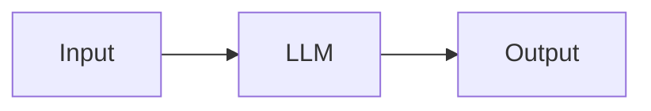
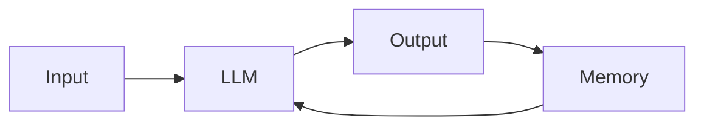
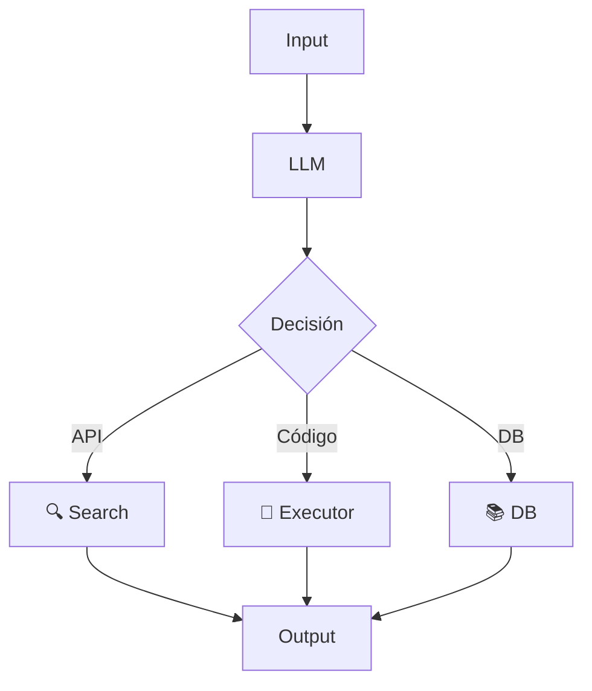
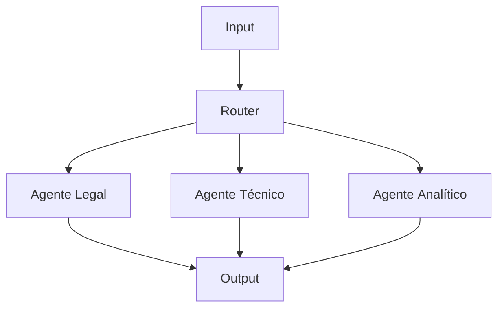
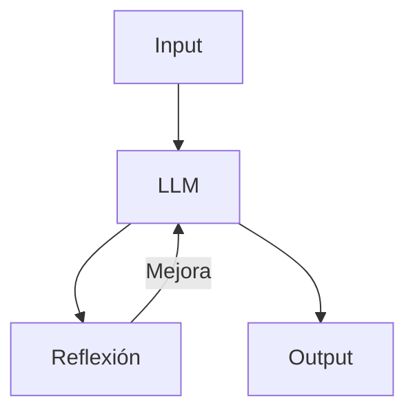
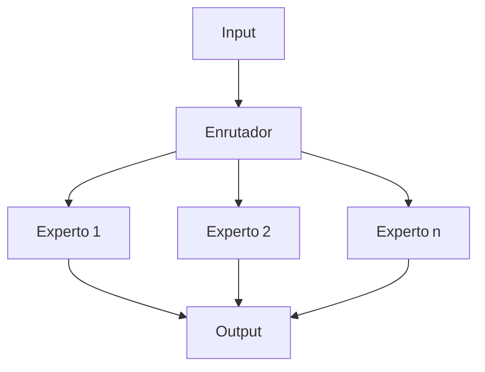
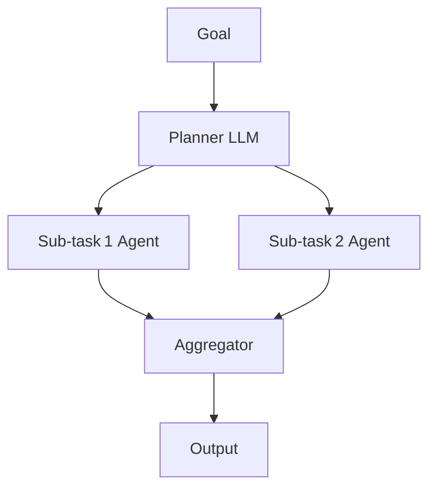
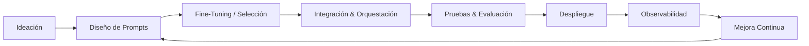
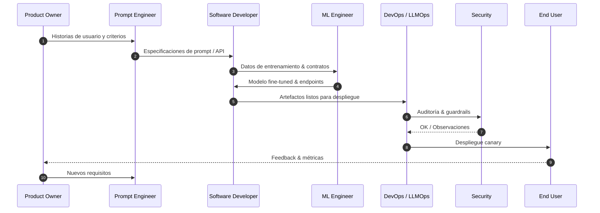
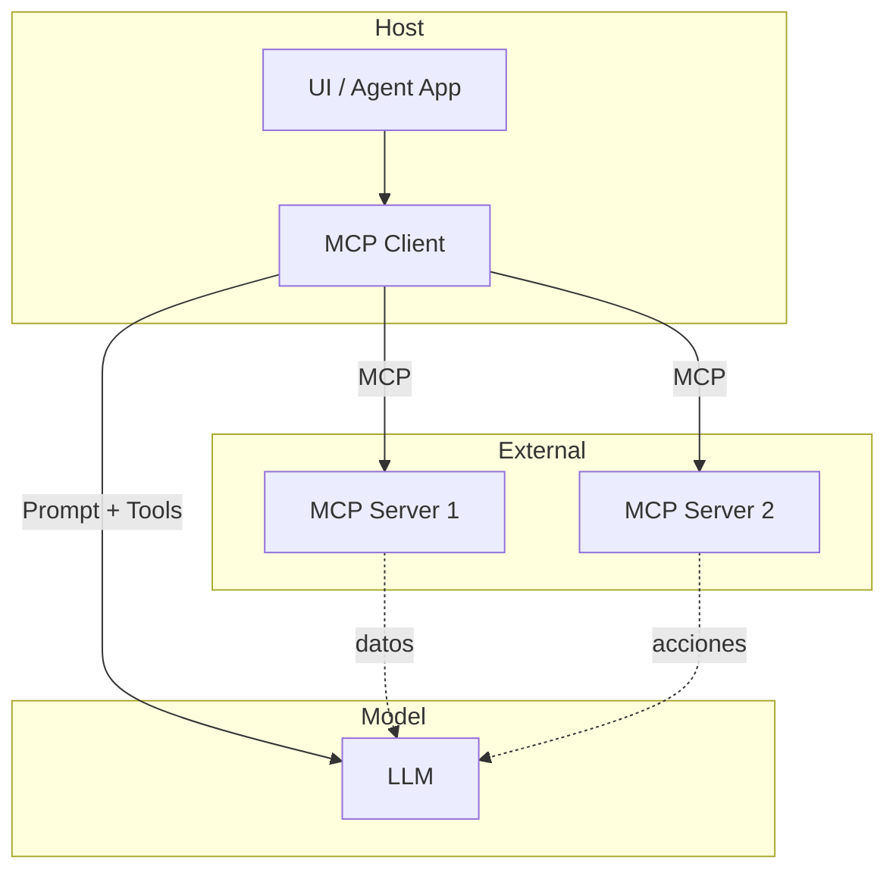

# 🗂️ Presentación — Modelos de Lenguaje (LLM) y Arquitecturas de Agentes

<!--
Si utilizas Reveal.js, separa cada diapositiva con "---".
-->

## 1. Agenda

1. Introducción a los LLM
2. Panorama de modelos comerciales y open‑source
3. Arquitecturas de agentes
4. **Ciclo de vida de desarrollo de software con LLMs**
5. Herramientas y frameworks
6. Model Context Protocol (MCP)
7. Métricas y evaluación
8. Desarrollo y despliegue
9. Casos de uso
10. Seguridad y ética
11. Optimización y escalabilidad
12. Tendencias futuras
13. Referencias

---

## 2. Introducción a los LLM

* **¿Qué es un LLM?** Modelo de redes neuronales preentrenado a gran escala capaz de comprender y generar lenguaje natural.
* **Capacidades clave**: comprensión contextual, razonamiento, generación de texto, traducción, sumarización.
* **Limitaciones**: alucinaciones, sesgos, sensibilidad al prompt, coste computacional.

---

## 3. Panorama de Modelos

### 3.1 Modelos de OpenAI

| Modelo            | Ventajas                                        | Desventajas                        |
| ----------------- | ----------------------------------------------- | ---------------------------------- |
| **GPT‑3.5‑turbo** | Bajo coste, baja latencia.                      | Menor capacidad de razonamiento.   |
| **GPT‑4**         | Alta precisión y alineación.                    | Coste y latencia mayores.          |
| **GPT‑4‑turbo**   | Rendimiento optimizado (mejor precio/latencia). | Aún en beta para algunas regiones. |

### 3.2 Modelos de Otros Proveedores

| Proveedor           | Modelo principal (2025)           | Destacado                                                          |
| ------------------- | --------------------------------- | ------------------------------------------------------------------ |
| **Anthropic**       | **Claude 3**                      | Enfoque en alineación y seguridad; ventana de contexto 200 k.      |
| **Google DeepMind** | **Gemini 1.5 Pro / PaLM 2**       | Capacidades multimodales y multilingües; servicio en Google Cloud. |
| **Meta**            | **LLaMA 3**                       | Open‑source, mejores benchmarks por parámetro, variantes 8‑400 B.  |
| **Mistral AI**      | **Mixtral‑8x22B / Mistral‑Large** | Arquitectura MoE eficiente; alto throughput de tokens.             |
| **xAI**             | **Grok‑1.5**                      | Ventana 128 k; pesos abiertos anunciados.                          |
| **Perplexity AI**   | **PPLX‑Llama‑3‑70B‑Chat**         | Fine‑tune para búsqueda conversacional.                            |
| **Cohere**          | **Command‑R+ / Embed‑v3**         | Optimizado para RAG (grounding) y embeddings de alta cobertura.    |
| *Otros open‑source* | **Zephyr‑7B, Phi‑3‑mini**         | Modelos compactos con licencias permisivas.                        |

\-----------|--------|-------|
\| **Anthropic** | **Claude 3** | Foco en seguridad y respuestas largas. |
\| **Google DeepMind** | **Gemini 1.5 / PaLM 2** | Multimodal y multilingüe. |
\| **Meta** | **LLaMA 2 / 3** | Open‑source, variantes 7‑70 B. |
\| **Mistral AI** | **Mistral‑Large / Mixtral‑8x22B** | MoE con 22 B rutas, SOTA en eficiencia. |
\| **xAI** | **Grok‑1.5** | Contexto ampliado, open‑weights anunciados. |
\| **Perplexity AI** | **PPLX‑Llama‑3‑70B‑Instruct** | Fine‑tune para búsqueda conversacional. |
\| **Cohere** | **Command‑R+** | Optimizado para RAG y grounding. |
\| *Open‑source* | **Mistral‑7B, Zephyr‑7B, Phi‑3‑mini** | Modelos compactos y permissive‑license.

\-----------|--------|-------|
\| **Anthropic** | **Claude 3** | Foco en seguridad y respuestas largas. |
\| **Google DeepMind** | **Gemini 1.5 / PaLM 2** | Multimodal y multilingüe. |
\| **Meta** | **LLaMA 2 / 3** | Open‑source, variantes 7‑70 B. |
\| *Open‑source* | **Mistral‑7B, Mixtral‑8x7B** | Arquitectura Mixture‑of‑Experts.

---

## 4. Arquitecturas de Agentes

### 4.1 Agente Simple

**Uso**: tareas ad‑hoc sin memoria (ej. Q\&A breve).

### 4.2 Agente con Memoria

**Uso**: chat continuo, asistentes personales.

### 4.3 Agente con Herramientas (ReAct 📖 \[7])

### 4.4 Multi‑Agente / Router

### 4.5 Agente Reflexivo (Reflexion 📖 \[8])

### 4.6 Agente MoE / Enrutador‑de‑Expertos

**Uso**: Modelos Mixture‑of‑Experts (p. ej., Mixtral‑8x22B) que activan sub‑modelos especializados para escalar sin aumentar latencia.

### 4.7 Agente Hierarchical Task Decomposition (HTD)

**Uso**: Descomponer objetivos complejos en subtareas, asignadas a agentes especializados, inspirado en "Generative Agents" y "LATS".

---

## 5. Ciclo de Vida de Desarrollo de Software con LLMs

### 5.1 Fases Principales

| Fase                                    | Objetivo                                                                                  | Entregables                                  | Herramientas Sugeridas                                                                              |
| --------------------------------------- | ----------------------------------------------------------------------------------------- | -------------------------------------------- | --------------------------------------------------------------------------------------------------- |
| **1. Ideación & Requisitos**            | Identificar problemas y casos de uso donde un LLM aporte valor.                           | Historias de usuario, métricas de éxito.     | Miro, Jira, Confluence, Notion, ChatGPT/Claude para brainstorming                                   |
| **2. Diseño de Prompts & Arquitectura** | Especificar prompts, elegir approach (RAG, KG‑RAG, Tools) y definir diagramas de agentes. | Documentos de diseño, prototipos de prompt.  | PromptLayer, Humanloop, LangSmith Playground, Mermaid / diagrams.net, LlamaIndex, LangChain Schemas |
| **3. Selección / Fine‑Tuning**          | Escoger modelo base o entrenar/fine‑tune con datos privativos.                            | Checkpoints del modelo, evaluación offline.  | Hugging Face Transformers, PEFT/LoRA, NVIDIA NeMo, Weights & Biases, vLLM, Azure OpenAI FT UI       |
| **4. Integración & Orquestación**       | Conectar LLM con APIs, bases de datos y UIs; implementar guards y control de costos.      | Código de servicios, pruebas de integración. | LangChain, LlamaIndex, OpenAI Assistants API, FastAPI, Airflow/Prefect, AWS Step Functions          |
| **5. Pruebas & Evaluación**             | Validar precisión, seguridad y UX usando métricas automáticas + revisión humana.          | Reportes de pruebas, aceptación de producto. | LangSmith Eval, TruLens, Promptfoo, OpenAI Evals, LlamaIndex Eval, pytest, Playwright               |
| **6. Despliegue (CI/CD)**               | Automatizar releases, canary, rollback; infraestructura reproducible.                     | Pipelines CI/CD, manifiestos Terraform.      | GitHub Actions, GitLab CI/CD, Docker, Terraform, Helm, ArgoCD, Spinnaker                            |
| **7. Observabilidad & Monitoreo**       | Rastrear trazas, latencia, costos y seguridad (LLMOps).                                   | Dashboards, alertas, datasets de logs.       | OpenTelemetry, Arize Phoenix, PromptLayer, Grafana, Prometheus, Datadog, Sentry                     |
| **8. Mejora Continua**                  | Recopilar feedback de producción, re‑entrenar y refinar prompts/modelos.                  | Backlog de mejoras, modelos actualizados.    | Label Studio, Segment, Amplitude, MLflow/Kubeflow, active‑learning pipelines                        |

### 5.2 Diagrama de Flujo (Mermaid) Diagrama de Flujo (Mermaid)

### 5.3 Roles Clave

* **Product Owner / UX**: define valor de negocio y criterios de éxito.
* **Software Developers**: implementan funcionalidades, integran APIs de LLM/RAG y mantienen el código.
* **Prompt Engineer**: diseña y prueba prompts / system messages.
* **ML Engineer**: fine‑tune, evalúa y optimiza modelos.
* **DevOps / LLMOps**: CI/CD, escalabilidad, monitoreo.
* **Security & Compliance**: revisa PII, políticas y auditorías.

### 5.4 Buenas Prácticas Buenas Prácticas

1. **Shift‑Left Testing**: validar prompts y seguridad desde fases tempranas.
2. **Data Contracts**: versionar datasets de entrenamiento y RAG.
3. **Human‑in‑the‑Loop**: bucles de revisión humana para casos críticos.
4. **Blue/Green o Canary Deploys** para minimizar riesgo.
5. **Continuous Evaluation** con benchmarks y evaluadores automáticos (p. ej., LlamaIndex Eval o GPT‑Judge).

### 5.5 Diagrama de Interacciones (Mermaid)

\--------|---------|-------------|
\| **Secuencial** | Pasos estrictamente en cadena. | ETL, pipelines deterministas. |
\| **Paralelo** | Múltiples ramas simultáneas. | Análisis en lote o fusión de fuentes. |
\| **Condicional** | Ramas basadas en lógica. | Flujos con reglas o clasificadores. |
\| **Iterativo** | Bucle de mejora (reflexión/pruebas). | Optimización de respuestas. |

---

## 6. Herramientas y Frameworks

### Frameworks para Agentes

* **LangChain \[9]** • **LangGraph** • **LlamaIndex** • **AutoGPT \[11]** • **BabyAGI \[12]**
* **OpenAI Assistants API**: orquestación nativa de herramientas

### Almacenamiento y Recuperación

* **Vector Stores**: FAISS, Pinecone, Weaviate
* **Graph Stores**: Neo4j, TigerGraph, Amazon Neptune

### Embeddings

* `text‑embedding‑3‑large`, `all‑MiniLM‑L6`

### Retrieval‑Augmented Generation (RAG)

* **Standard RAG**: búsqueda vectorial + generación
* **KG‑RAG (RAG + Knowledge Graph)**: fusiona contexto vectorial con grafos de conocimiento para respuestas más precisas y trazables
  **Frameworks**: Arize Phoenix KG‑RAG, Neo4j GenAI, GraphRAG (LlamaIndex)

### Orquestación y Observabilidad

* **Airflow / Prefect**: pipelines programables
* **OpenTelemetry**: trazas unificadas para LLMs
* **Arize Phoenix**: monitoreo y depuración de RAG/LLM

---

## 7. Model Context Protocol (MCP)

### 7.1 Visión General

El **Model Context Protocol (MCP)** es un estándar abierto que define **cómo** las aplicaciones proporcionan contexto y herramientas a los LLMs —similar a un "USB‑C" para conectar fuentes de datos, APIs y capacidades externas de forma uniforme. citeturn0search2

### 7.2 Componentes Principales

* **MCP Host**: Aplicación que aloja al agente (p. ej., un chat o dashboard).
* **MCP Client**: Manejador dentro del host que solicita acciones/contexto.
* **MCP Server(s)**: Puente hacia datos o herramientas concretas (CRM, GitHub, bases de conocimiento). citeturn0search0turn0search1

### 7.3 Arquitectura de Referencia

### 7.4 Beneficios Clave

1. **Interoperabilidad**: Un solo protocolo para múltiples fuentes y herramientas.
2. **Seguridad**: Control granular de permisos (read‑only, read‑write). citeturn0search6
3. **Escalabilidad**: Conectar nuevos back‑ends sin reescribir prompts.
4. **Observabilidad**: Facilita trazas y auditoría de llamadas de herramienta.

### 7.5 Ecosistema y Herramientas

| Categoría                  | Ejemplos                                                                                |
| -------------------------- | --------------------------------------------------------------------------------------- |
| **SDKs**                   | `openai-agents-python` citeturn0search8, `lastmile-ai/mcp-agent` citeturn0search3 |
| **Servers Ready‑Made**     | Replit Codebase MCP, Anthropic Repo Connector citeturn0news16                        |
| **Frameworks Compatibles** | LangChain, LangGraph, CrewAI, LlamaIndex                                                |

### 7.6 Casos de Uso

* **Enterprise Agents**: Acceso seguro a Salesforce, SAP, GitHub.
* **RAG Dinámico**: Inyectar contexto de bases de conocimiento corporativas.
* **Orquestación de Herramientas**: LLM decide usar "crear PR" o "consultar DB" vía MCP.

## 8. Métricas y Evaluación y Evaluación

| Métrica           | ¿Qué mide?                         |
| ----------------- | ---------------------------------- |
| **Precisión**     | Corrección factual.                |
| **Latencia**      | Tiempo medio de respuesta.         |
| **Costo**         | Tokens × precio.                   |
| **Consistencia**  | Coherencia entre respuestas.       |
| **Tasa de Éxito** | Respuestas satisfactorias / total. |

### Herramientas

* **LangSmith**: trazabilidad, costo y A/B.
* **LangWatch**: monitoreo en tiempo real y alertas.

---

## 9. Desarrollo y Despliegue y Despliegue

### 8.1 Metodologías

* **Iterativo / Prompt‑Engineering**
* **TDD para agentes y flujos**
* **CI/CD + Canary Releases**

### 8.2 Stack de Despliegue

| Capa               | Opción                          |
| ------------------ | ------------------------------- |
| **Frontend**       | Next.js / Vercel                |
| **Backend**        | FastAPI / AWS Lambda            |
| **Infra**          | Docker • Kubernetes • Terraform |
| **Observabilidad** | Prometheus • Grafana • Datadog  |

---

## 10. Casos de Uso

1. **Soporte al cliente** → FAQ, routing, análisis de sentimiento.
2. **Desarrollo de software** → asistentes de código, documentación.
3. **Análisis de datos** → reportes automáticos y dashboarding.
4. **Automatización de procesos** → RPA + LLM para documentos.

---

## 11. Seguridad y Ética y Ética

* **Protección de datos**: cifrado, PII redaction.
* **Prevención de abusos**: rate‑limiting, filtros de contenido.
* **Transparencia & Sesgos**: system cards, auditorías, datasets diversos.

---

## 12. Optimización y Escalabilidad y Escalabilidad

* **Costos**: caching, modelos más pequeños, batch.
* **Escalabilidad**: serverless, auto‑scaling, horizontality.

---

## 13. Tendencias Futuras Futuras

* Agentes más autónomos (long‑term planning).
* Mayor integración con APIs y herramientas externas.
* Personalización a nivel de usuario/vertical.
* Avances en alignment, seguridad y explicabilidad.

---

## 14. Referencias

1. T. Brown et al., “Language Models are Few‑Shot Learners,” *NeurIPS*, 2020.
2. OpenAI, “GPT‑4 Technical Report,” 2023.
3. S. Bubeck et al., “Sparks of AGI: Early experiments with GPT‑4,” MSR TR‑2023‑8.
4. Anthropic, “Claude 3 System Card,” 2024.
5. A. Chowdhery et al., “PaLM: Scaling Language Modeling with Pathways,” *arXiv*, 2022.
6. H. Touvron et al., “LLaMA 2: Open Foundation and Fine‑Tuned Chat Models,” *arXiv*, 2023.
7. S. Yao et al., “ReAct: Synergizing Reasoning and Acting in Language Models,” *ICLR*, 2023.
8. J. Shinn & L. Labash, “Reflexion: Language Agents with Internal Chain of Thought,” *arXiv*, 2023.
9. LangChain Docs [https://python.langchain.com](https://python.langchain.com).
10. LangSmith Docs [https://smith.langchain.com](https://smith.langchain.com).
11. *AutoGPT* GitHub Repository, Significant Gravitas, 2023.
12. *BabyAGI* GitHub Repository, Yohei Nakajima, 2023.
13. P. Lewis et al., “Retrieval‑Augmented Generation for Knowledge‑Intensive NLP Tasks,” *arXiv*, 2020.
14. Arize AI, “Phoenix: Open‑Source Observability for LLMs and RAG,” 2024.
15. Neo4j, “GenAI Stack & Knowledge‑Graph‑RAG,” 2024.
16. Mistral AI, “Mixtral‑8x22B & Mistral‑Large Technical Report,” 2024.
17. xAI, “Grok‑1.5 Model Card,” 2024.
18. Cohere, “Command‑R+ Technical Overview,” 2024.
19. Perplexity AI, “PPLX Llama‑3 70B Release Notes,” 2025.
20. S. Fedus et al., “Switch Transformers: Scaling to Trillion Parameter Models with Simple and Efficient Sparsity,” *arXiv*, 2021.
21. X. Li et al., “Hierarchical Planning for Language‑Based Agents,” *arXiv*, 2024.
22. Model Context Protocol Docs [https://modelcontextprotocol.io](https://modelcontextprotocol.io).
23. T. Balarabe, “What is Model Context Protocol? Architecture Overview,” *Medium*, 2025.

---
