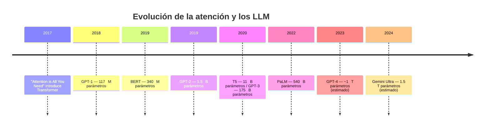
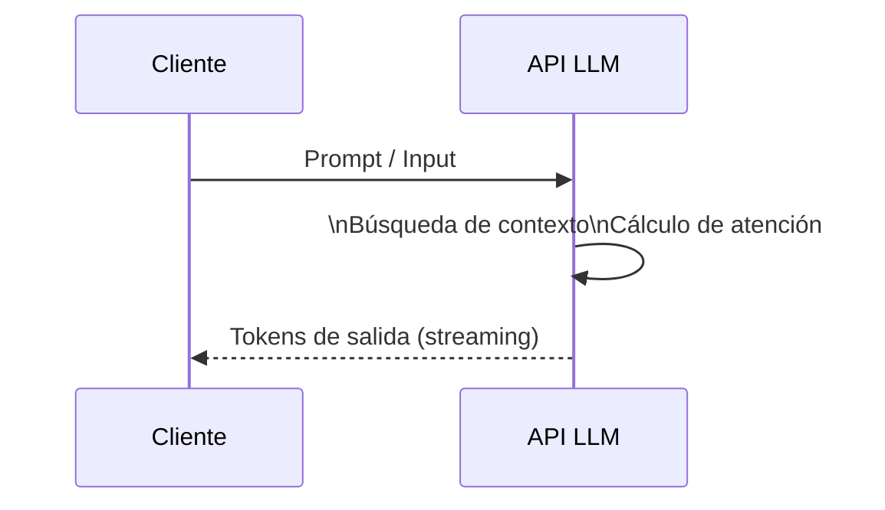
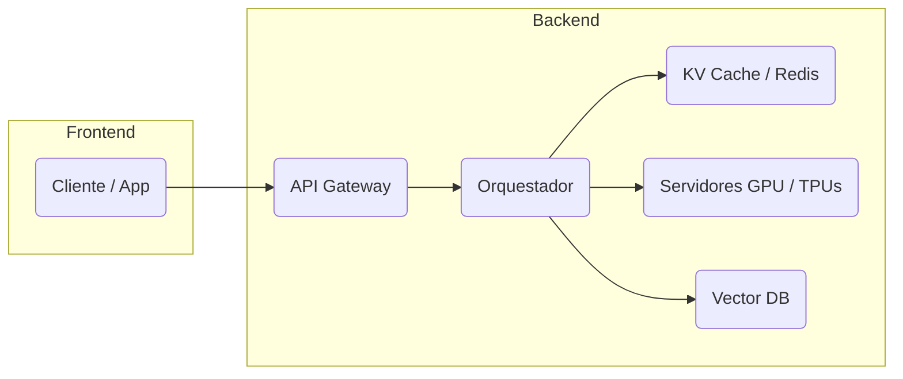

# Presentación ‑ ¿Qué son y cómo funcionan los **Large Language Models (LLM)?**

> Una guía visual y concisa para comprender el origen, la arquitectura y el ciclo de vida de los modelos de lenguaje de gran escala.

---

## Agenda

1. Definición y contexto histórico
2. Origen: del *Transformer* a los LLM actuales
3. Anatomía de un LLM
4. Proceso de entrenamiento (pre‑entrenamiento & ajustes)
5. Inferencia y *serving* en producción
6. Casos de uso, riesgos y buenas prácticas
7. Glosario y referencias clave

---

## 1. ¿Qué es un LLM?

*Un **Large Language Model** es una red neuronal basada en la arquitectura Transformer con miles de millones de parámetros, entrenada en grandes corpus de texto para modelar la probabilidad de la siguiente secuencia de tokens.*

* Habilidad principal: **modelado de lenguaje** → predice el siguiente token.
* Capacidad emergente: razonamiento, traducción, síntesis, generación de código.

---

## 2. Orígenes y evolución

### De la atención al lenguaje masivo



*La tendencia muestra un crecimiento exponencial del tamaño y la capacidad.*

---

## 3. Anatomía de un LLM

### Flujo de datos interno

```mermaid
flowchart TD
  A[Input] --> B["Tokenización\n(BPE, WordPiece)"]
  B --> C[Embeddings (vector d_model)]
  C --> D[Capas \*N Transformer<br/>Self‑Attention & Feed‑Forward]
  D --> E[Proyección a vocabulario
  (logits)]
  E --> F[Softmax → Probabilidades]
  F --> G[Decodificación<br/>siguiente token]
```

### Componentes clave

| Componente                   | Rol                       | Detalle técnico                                                    |
| ---------------------------- | ------------------------- | ------------------------------------------------------------------ |
| **Embeddings**               | Vectorizar tokens         | Dimensión típica 768‑16 384                                        |
| **Self‑Attention**           | Mezclar contexto          | Mecanismo \$\text{softmax}\left(\frac{QK^T}{\sqrt{d\_k}}\right)V\$ |
| **Feed‑Forward**             | Transformación no lineal  | 2‑4× la dimensión del modelo + GELU                                |
| **Normalización & Residual** | Estabilizar entrenamiento | *LayerNorm* + atajos                                               |

---

## 4. Proceso de entrenamiento

```mermaid
flowchart TD
  subgraph Pre‑entrenamiento
    A1(Corpus masivo\nInternet, libros, código) --> A2[Tokenización]
    A2 --> A3[Objetivo: \nPredicción de siguiente token]
    A3 --> A4[Actualización de peso\n(Backprop + AdamW)]
  end
  A4 --> B1{Modelo pre‑entrenado}
  B1 --> C1[Fine‑Tuning supervisado\n+ Instrucciones]
  C1 --> C2[RLHF / DPO\nAliniación con humanos]
  C2 --> D1{Modelo alineado y listo para producción}
```

**Pérdida total:** \$\mathcal{L} = \mathcal{L}*{MLE} + \lambda*{RL} ; \mathcal{L}\_{RLHF}\$

---

## 5. Inferencia y *Serving*



### Estrategias de decodificación

| Método                 | Control      | Uso típico                    |
| ---------------------- | ------------ | ----------------------------- |
| *Greedy*               | Determinista | Respuestas cortas y factuales |
| *Beam Search*          | Cobertura    | Traducción                    |
| *Nucleus Sampling (p)* | Diversidad   | Creatividad                   |
| *Temperature*          | Aleatoriedad | Brainstorming                 |

### Arquitectura de producción simplificada



---

## 6. Casos de uso, riesgos y buenas prácticas

### Casos de uso

* **Asistentes conversacionales** (ChatGPT, Gemini, Claude)
* **Programación asistida** (Cursor, GitHub Copilot)
* **Análisis documental y RAG**
* **Traducción y localización**

### Riesgos

| Riesgo                        | Mitigación                                     |
| ----------------------------- | ---------------------------------------------- |
| Alucinaciones                 | RAG + verificación factual                     |
| Filtración de datos sensibles | Enmascarado / hashing antes de envío           |
| *Prompt injection*            | Sanitización y *guardrails*                    |
| Costos de inferencia          | **KV‑Cache**, cuantización, mezcla de expertos |

---

## 7. Glosario

| Término            | Definición breve                                         |
| ------------------ | -------------------------------------------------------- |
| **Token**          | Unidad mínima de entrada (≈ sub‑palabra)                 |
| **Parámetro**      | Valor entrenable de la red                               |
| **Self‑Attention** | Mecanismo que asigna pesos a cada token según relevancia |
| **RLHF**           | *Reinforcement Learning from Human Feedback*             |
| **RAG**            | *Retrieval‑Augmented Generation*                         |

---

## 8. Referencias recomendadas

1. Vaswani et al., *Attention Is All You Need*, 2017.
2. Brown et al., *Language Models are Few‑Shot Learners* (GPT‑3), 2020.
3. OpenAI, *GPT‑4 Technical Report*, 2023.
4. Anthropic, *Constitutional AI*, 2023.
5. Google, *Gemini: A family of highly capable multimodal models*, 2024.

---

### ¡Gracias!

> **Contacto:** [tu‑nombre@ejemplo.com](mailto:tu‑nombre@ejemplo.com)

---

*Esta presentación está diseñada en Markdown con diagramas Mermaid para facilitar su visualización en plataformas como GitHub o VS Code.*
